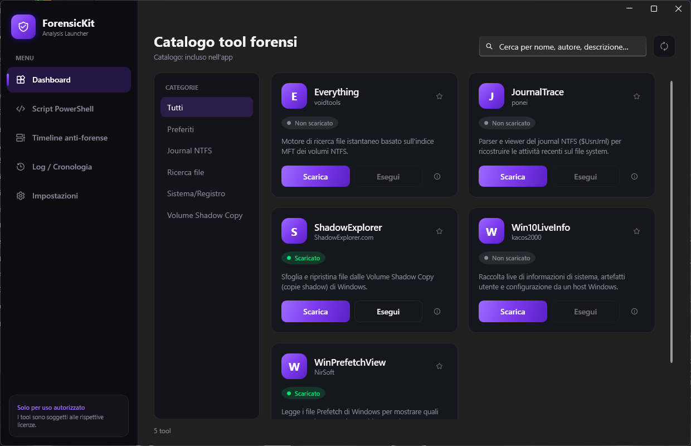
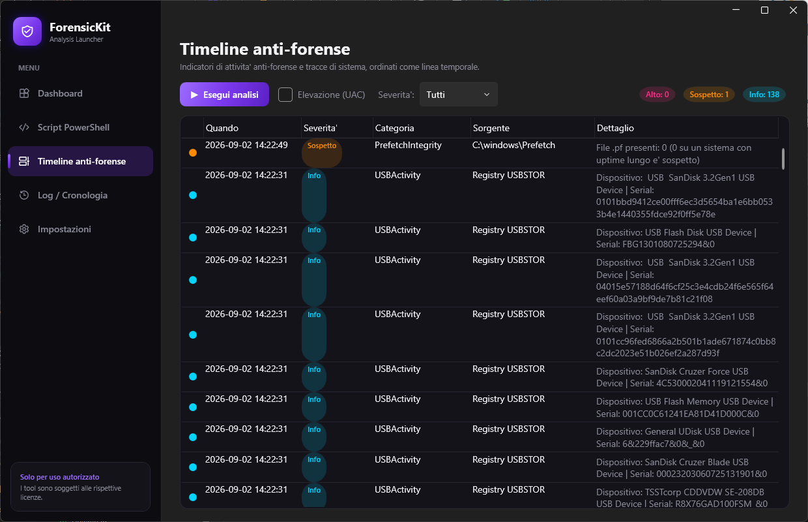

# ForensicKit

> Nome provvisorio — modificabile.

**ForensicKit** è un'applicazione desktop Windows **open source** che funge da
**launcher / aggregatore** per tool forensi e di analisi di sistema di terze parti,
con una suite di **script PowerShell integrati** per la raccolta di artefatti e la
rilevazione di anomalie (DMA card, token di processo, tracce anti-forensi).
Non ridistribuisce i tool: li scarica dalle fonti ufficiali, ne verifica l'integrità,
li esegue e tiene traccia di download ed esecuzioni.

  

## Screenshot

**Dashboard / catalogo tool** (tema scuro ispirato a pannelli admin moderni):



**Timeline anti-forense** (tabella stile timeline, colorata per severità):



---

## Caratteristiche

- 🗂️ **Catalogo a card/dashboard** (dark theme, accento viola) organizzato per categoria,
  con badge di stato (*Non scaricato / Scaricato / Aggiornamento disponibile*), ricerca e preferiti.
- ⬇️ **Downloader** asincrono con progress bar, **resume** (HTTP Range), **retry** con
  back-off e **verifica SHA-256**; estrazione ZIP con protezione *zip-slip*.
- ▶️ **Esecutore** con eventuale **elevazione UAC** (`runas`), argomenti personalizzabili
  e cattura opzionale di stdout/stderr per i tool a riga di comando.
- 🧾 **Script PowerShell integrati** (inclusi nell'app, **non** scaricati da remoto),
  con console integrata ed export in `.txt` / `.json`.
- 🕵️ **Timeline anti-forense**: pagina dedicata che mostra gli indicatori raccolti in una
  **tabella/timeline** GUI, ordinata per tempo e colorata per severità.
- 🔄 **Manifest aggiornabile**: catalogo in JSON scaricabile da GitHub, con **validazione**
  e **fallback** al manifest locale/incluso se offline o malformato.
- 🛡️ **Sicurezza & trasparenza**: dialog pre-avvio con **fonte, hash e firma digitale**,
  log **append-only** (chain-of-custody), nessuna manomissione di SmartScreen/Defender.

## Script PowerShell inclusi

Tutti in `src/ForensicKit.Scripts/`, **inclusi nell'eseguibile** e ispezionabili:

| Script | Descrizione | Elevazione |
|---|---|---|
| `Collect-SystemInfo.ps1` | Snapshot OS, hardware, dischi, rete, utenti | No |
| `List-SuspiciousProcesses.ps1` | Processi in percorsi insoliti, immagini non firmate, servizi auto-start | No |
| `Get-UsbDeviceHistory.ps1` | Storico dispositivi USB (USBSTOR) | Consigliata |
| `Get-RecentSecurityEvents.ps1` | Logon/logon falliti/lockout/nuovi servizi | Sì |
| `Detect-DmaDevices.ps1` | Rilevamento **DMA card** (PCILeech/PCIeScreamer/ZDMA) via analisi PCIe + `pci.ids` + blocklist + stato VT-d/IOMMU | No |
| `Test-ProcessTokens.ps1` | Verifica **token/permessi** dei processi (Integrity, privilegi, SID, token stealing) e stati anomali — utile in contesto **anticheat** | No |
| `AntiForensicHunter.ps1` (**ScriptZ**) | Indicatori **anti-forensi**: log cancellati, modifica orario, USN Journal, USB, Zone.Identifier/MOTW, prefetch. Alimenta la **Timeline** | Sì |

## Architettura

```
/src
  /ForensicKit.App        WPF (WPF-UI, MVVM con CommunityToolkit.Mvvm) — UI
  /ForensicKit.Core       Logica: download, esecuzione, manifest, hash, firma, log
  /ForensicKit.Scripts    Script .ps1 (embedded come risorse nell'app)
/tests
  /ForensicKit.Core.Tests xUnit — test della logica Core
/manifests
  tools.json              Catalogo ufficiale (PR-friendly)
/config
  dma-blocklist.sample.json  Esempio di blocklist DMA card
/docs
  images/                 Screenshot per il README
  CONTRIBUTING.md         Come aggiungere un tool al manifest
README.md
LICENSE
```

Lo **stack**: C# / **.NET 8** (Windows Desktop) · **WPF** + **WPF-UI** (Fluent, dark) ·
**MVVM** (CommunityToolkit.Mvvm) · `HttpClient` con resume/progress ·
`System.Diagnostics.Process` (+ `Verb = "runas"`) · persistenza **JSON** in `%APPDATA%\ForensicKit`.

> La UI (`ForensicKit.App`) dipende dal Core ma il Core **non** dipende dalla UI: tutta la
> logica è isolata dietro interfacce e coperta da unit test.

## Requisiti

- Windows 10 / 11 (x64)
- Per lo sviluppo: **.NET SDK 8.0+**

## Build

```powershell
dotnet build ForensicKit.slnx -c Release
dotnet test  tests/ForensicKit.Core.Tests/ForensicKit.Core.Tests.csproj
dotnet run   --project src/ForensicKit.App/ForensicKit.App.csproj
```

## Pubblicazione (single-file self-contained)

```powershell
dotnet publish src/ForensicKit.App/ForensicKit.App.csproj -c Release -o publish
```

Produce un unico `publish/ForensicKit.exe` (~70 MB) che include il runtime .NET:
non richiede installazioni sulla macchina di destinazione.

## Il manifest (catalogo)

Il catalogo **non è hardcoded**: è definito in [`manifests/tools.json`](manifests/tools.json)
ed è aggiornabile da remoto (`raw.githubusercontent.com`). I tool su GitHub usano
`"sourceType": "github_release"` (ultima release automatica via API); quelli con pagina
statica usano `"sourceType": "direct_url"`. Vedi
[`docs/CONTRIBUTING.md`](docs/CONTRIBUTING.md) per aggiungere un nuovo tool.

## Dove vengono salvati i dati

Tutto sotto `%APPDATA%\ForensicKit`:

| Percorso | Contenuto |
|---|---|
| `settings.json` | Impostazioni utente |
| `tools.json` | Copia locale (cache) del manifest remoto |
| `pci.ids` | Cache del database PCI (per lo script DMA) |
| `dma-blocklist.json` | Blocklist DMA card modificabile |
| `Tools\{id}\` | File estratti di ogni tool + stato (versione, hash) |
| `Logs\audit.log.jsonl` | Log **append-only** di download ed esecuzioni |

## Sicurezza

- Prima del **primo avvio** di un tool scaricato: avviso con **fonte, URL, SHA-256 e firma** (Authenticode).
- L'app **non disabilita** SmartScreen/Defender e **non modifica** le protezioni di sistema.
- Log delle esecuzioni **append-only** per la chain-of-custody.
- L'app gira come utente normale (`asInvoker`) ed **eleva i singoli tool on-demand**.

## ⚖️ Disclaimer legale

ForensicKit è un **launcher**: **non** ridistribuisce né include i binari dei tool di
terze parti. Ogni tool viene scaricato dalla sua fonte ufficiale ed è soggetto alla
**propria licenza/EULA** (NirSoft, voidtools, ShadowExplorer, ponei/JournalTrace,
kacos2000/Win10LiveInfo, ecc.): è responsabilità dell'utente leggerle e rispettarle.

Il software è fornito "così com'è", **senza garanzie**. Gli strumenti forensi e di analisi
vanno usati **solo su sistemi di cui si è proprietari o per i quali si dispone di
autorizzazione esplicita** (es. verifiche anticheat su postazioni proprie). Gli autori
non sono responsabili di usi impropri.

## Licenza

Rilasciato sotto licenza **MIT** — vedi [LICENSE](LICENSE).
